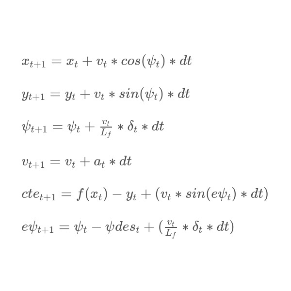

# CarND-Controls-MPC
Self-Driving Car Engineer Nanodegree Program

---

## Description
In this project I implemented a model predictive controller using 
a basic 2d kinematic motion model in c++ to drive a car in a simulator.

We treat it as an optimization problem, thus trying to minimize errors / unwanted behaviors.
My behavioral goals were to obtain a relaxed,smooth and safe driving experience.

## Implementation
### The Model
Our model is based on a 2d kinematic motion model, so our state consists of:
* px and py for position
* psi - heading/orientation
* v - velocity. 
* cte - cross track error, distance from middle of track
* epsi - orientation error

actuators are:
* throttle - acceleration/deceleration(gas/brakes) - [-1, 1]
* steering angle - [-1, 1]

The kinematic motion model equations are:


We use this equations to derive the current state from previous state and actuator commands.

Extra parameters:
* f(x) - evaluate the waypoints(middle of lane/road) third order polynomial for x
, then y is subtracted to find cte.
* Lf - This is the length from front to center of gravity that has a similar radius to the 
radius formed by running the vehicle in the simulator around in a circle with a constant 
steering angle and velocity on a flat terrain.

### Timestep Length and Elapsed Duration (N & dt)
N & dt should have a good trade-off between the present and the future, what do I mean by this?
dt should be low enough to react to changes(like turns) but not too low since it's computationally expensive.
N should look into the near future(with respect to dt), so the car will be able to 
react to upcoming changes in an optimal way, but not distant future since it will make the car react 
prematurely to far away changes and moving in some unpredictable ways. 

My chosen values are N=10 and dt=0.1.
I tried values ranging from 10 - 25 for N and 0.05 - 0.2 for dt.
Both parameters have high correlation but in general:
* High N values made the car oscillate badly.
* High dt values made the car react slow and deviate from optimal route.
N from 10-15 worked good, dt from 0.05-0.1 worked good as well.

### Polynomial Fitting and MPC Preprocessing
Waypoints were transformed to vehicle's point of view, thus simplifying 
many of the calculations and the visualization of the waypoints(yellow line).

A third order polynomial was fitted to the waypoints after transformation.

### Model Predictive Control with Latency
For me as a kid latency was a big problem during multi player computer games, finally I can do something about it.
In a fast pace dynamic system like a driving car, latency can decrease stability as the actuator commands
are based on the past state instead of the current state.

I implemented latency as a change in state with the kinematic model equations with respect to latency(100 ms),
so the state at the time of the actuator commands is the actual state.

## Dependencies

* cmake >= 3.5
 * All OSes: [click here for installation instructions](https://cmake.org/install/)
* make >= 4.1(mac, linux), 3.81(Windows)
  * Linux: make is installed by default on most Linux distros
  * Mac: [install Xcode command line tools to get make](https://developer.apple.com/xcode/features/)
  * Windows: [Click here for installation instructions](http://gnuwin32.sourceforge.net/packages/make.htm)
* gcc/g++ >= 5.4
  * Linux: gcc / g++ is installed by default on most Linux distros
  * Mac: same deal as make - [install Xcode command line tools]((https://developer.apple.com/xcode/features/)
  * Windows: recommend using [MinGW](http://www.mingw.org/)
* [uWebSockets](https://github.com/uWebSockets/uWebSockets)
  * Run either `install-mac.sh` or `install-ubuntu.sh`.
  * If you install from source, checkout to commit `e94b6e1`, i.e.
    ```
    git clone https://github.com/uWebSockets/uWebSockets
    cd uWebSockets
    git checkout e94b6e1
    ```
    Some function signatures have changed in v0.14.x. See [this PR](https://github.com/udacity/CarND-MPC-Project/pull/3) for more details.

* **Ipopt and CppAD:** Please refer to [this document](https://github.com/udacity/CarND-MPC-Project/blob/master/install_Ipopt_CppAD.md) for installation instructions.
* [Eigen](http://eigen.tuxfamily.org/index.php?title=Main_Page). This is already part of the repo so you shouldn't have to worry about it.
* Simulator. You can download these from the [releases tab](https://github.com/udacity/self-driving-car-sim/releases).
* Not a dependency but read the [DATA.md](./DATA.md) for a description of the data sent back from the simulator.


## Basic Build Instructions

1. Clone this repo.
2. Make a build directory: `mkdir build && cd build`
3. Compile: `cmake .. && make`
4. Run it: `./mpc`.